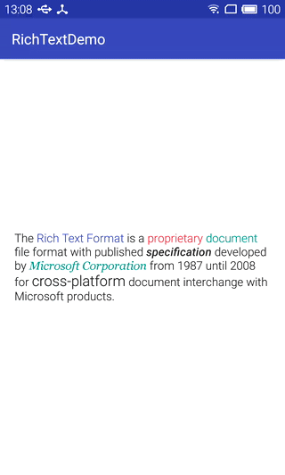

# RichText
[](https://jitpack.io/#xymelon/richtext)

This library parses string with custom tags to `Spannable` string.

## Features
- [x] hyperlink click event (with pressed text and background color)
- [x] click event (with pressed text and background color)
- [x] text background color
- [x] text foreground color
- [x] text size
- [x] text style (bold, italic)
- [x] text font

Of course, you can add custom typeface span with api `addTypeSpan`.



## Installation
In your project level `build.gradle` :

```java
allprojects {
    repositories {
        ...
        maven { url "https://jitpack.io" }
    }
}
```
In your app level `build.gradle` :

```java
dependencies {
    compile 'com.github.xymelon:richtext:1.0.4'
}
```

## Usage with custom tags
```java
TextView textView = (TextView) findViewById(R.id.textView);

final int foregroundTextColor = ContextCompat.getColor(this, R.color.T1);
final int linkTextColor = ContextCompat.getColor(this, R.color.colorPrimary);
final int normalTextColor = ContextCompat.getColor(this, R.color.R1);
final int pressedTextColor = ContextCompat.getColor(this, R.color.W1);
final int pressedBackgroundColor = ContextCompat.getColor(this, R.color.B1);
final Typeface georgiaTypeface = Typeface.createFromAsset(getAssets(), "fonts/Georgia Italic.ttf");

RichText richText = new RichText.Builder()
        .addBlockTypeSpan(new ClickSpan(
                normalTextColor,
                pressedTextColor,
                pressedBackgroundColor,
                new ClickSpan.OnClickListener() {
                    @Override
                    public void onClick(CharSequence text, float rawX, float rawY) {
                        Toast.makeText(MainActivity.this, text, Toast.LENGTH_SHORT).show();
                    }
                }), "c")
        .addBlockTypeSpan(new IStyleSpan() {
            @Override
            public CharacterStyle getStyleSpan() {
                return new ForegroundColorSpan(foregroundTextColor);
            }
        }, "f", "t")
        .addBlockTypeSpan(new IStyleSpan() {
            @Override
            public CharacterStyle getStyleSpan() {
                return new StyleSpan(Typeface.BOLD_ITALIC);
            }
        }, "bi")
        .addBlockTypeSpan(new IStyleSpan() {
            @Override
            public CharacterStyle getStyleSpan() {
                return new TextAppearanceSpan(MainActivity.this, R.style.TextSize);
            }
        }, "s")
        .addBlockTypeSpan(new FontTypefaceSpan(georgiaTypeface), "t")
        .addLinkTypeSpan(new LinkClickSpan(
                linkTextColor,
                pressedTextColor,
                pressedBackgroundColor,
                new LinkClickSpan.OnLinkClickListener() {
                    @Override
                    public void onClick(String url) {
                        Toast.makeText(MainActivity.this, url, Toast.LENGTH_SHORT).show();
                    }
                })
        )
        .build();
//notice: if set click span, you must invoke this method.
richText.with(textView);

String tagString = "The <a href='https://en.wikipedia.org/wiki/Rich_Text_Format'>Rich Text Format</a> " +
        "is a <c>proprietary</c> <f>document</f> file format with published <bi>specification</bi> " +
        "developed by <t>Microsoft Corporation</t> from 1987 until 2008 for <s>cross-platform</s> document interchange " +
        "with Microsoft products.";
textView.setText(richText.parse(tagString));
```

## License
```
Copyright 2017 xymelon.

Licensed under the Apache License, Version 2.0 (the "License");
you may not use this file except in compliance with the License.
You may obtain a copy of the License at

   http://www.apache.org/licenses/LICENSE-2.0

Unless required by applicable law or agreed to in writing, software
distributed under the License is distributed on an "AS IS" BASIS,
WITHOUT WARRANTIES OR CONDITIONS OF ANY KIND, either express or implied.
See the License for the specific language governing permissions and
limitations under the License.
```
